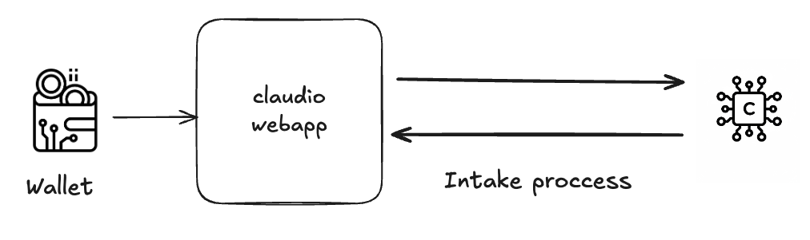
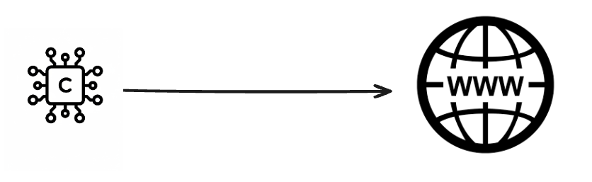
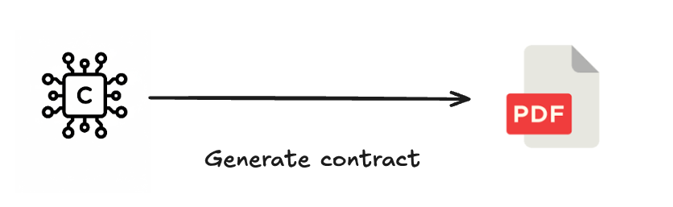
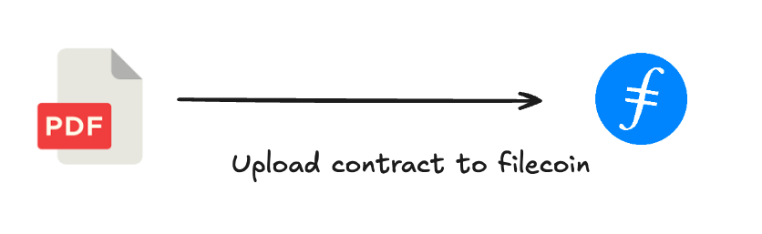
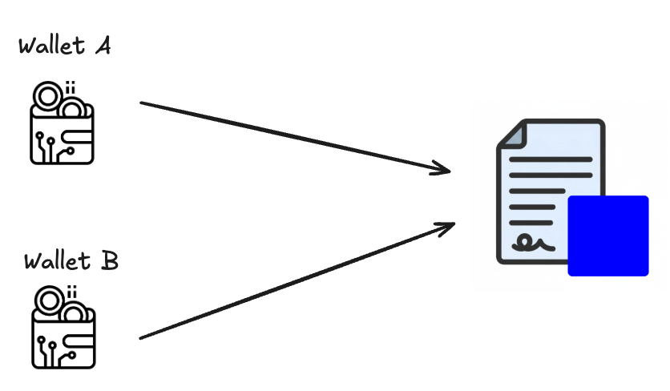

# Claudio - Legal Onchain Agent

            
    

**Claudio** is an onchain legal agent that helps sign legal contracts between different jurisdictions in **LATAM**.  
Born from **Cristian's** need, who when hiring web3 talent in Latin America from Chile, lacked clear legal contracts and protection mechanisms.

---

## 🚀 Claudio's Process

Claudio follows a simple and secure flow to generate legal contracts:

1. **Intake**  
   - Claudio converses with the person who needs the contract.  
   - Collects information: name of the person to be hired and country of origin.  
   - Once it exceeds a **0.9 confidence threshold**, the information is considered complete.  

   

2. **Legal Research**  
   - Claudio analyzes each country's regulations to validate hiring conditions.  

   

3. **Contract Drafting**  
   - Claudio drafts a contract with the obtained information and corresponding regulations.  
   

4. **IPFS + Filecoin Persistence**  
   - The contract is stored on **IPFS** and long-term persistence is ensured through **Filecoin**.  

5. **Signing Link Generation**  
   - Claudio creates a unique link for interested parties to access the contract and proceed with signing.     

6. **Contract Signing**  
   - Users sign the contract, leaving legal and onchain record.  

---

## 🌎 Scope

Claudio is specially designed for **Latin America**, facilitating hiring between countries with different legal jurisdictions in the **web3** ecosystem.

---

## 📌 Roadmap

- [ ] Integration with wallets for onchain signing.  
- [ ] Support for multilateral contracts.  
- [ ] Compatibility with international regulations.  

---

